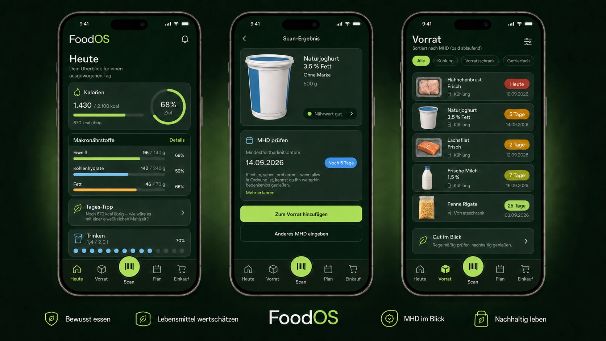
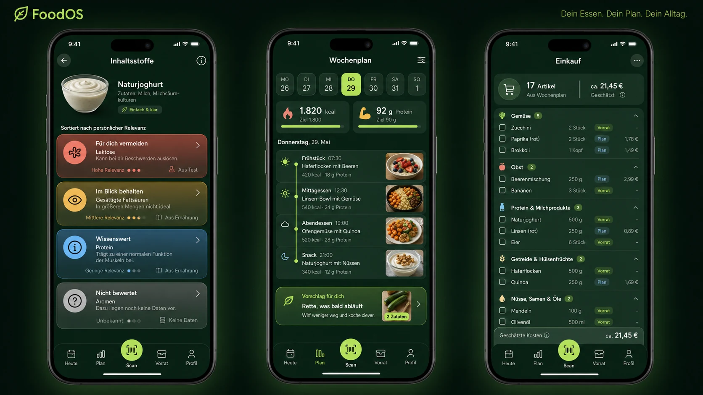

# FoodOS Mockups and Screen Catalogue

Status: **North-star direction for the MVP** · Last updated: 2026-08-02

These mockups define visual quality, hierarchy, density, and product feeling. They do
not override `design.md`, the database model, or the exact behavior in
`plans/USER_FLOWS.md`. Generated text, dates, product data, and navigation details in a
board are illustrative; production UI must use validated real data and the canonical
five-tab navigation: **Heute · Vorrat · Scan · Plan · Einkauf**.

The platform/adaptive/accessibility/performance contract in
[`plans/UI_UX_PERFORMANCE_PLAN.md`](../plans/UI_UX_PERFORMANCE_PLAN.md) is authoritative
for implementation. A generated board is neither a responsive specification nor
usability evidence; new critical flows require the research/retest process in
[`plans/UX_RESEARCH_AND_USABILITY_TESTING.md`](../plans/UX_RESEARCH_AND_USABILITY_TESTING.md).

## Board A – Today, scan result, and inventory

What to carry into production:

- one dominant metric and action per screen;
- calm forest-green depth with lime reserved for progress and primary actions;
- the center scan action remains immediately reachable;
- product identity appears before metadata detail;
- expiry status uses text, color, and action together;
- inventory is optimized for fast scanning rather than decorative cards.

What not to copy literally:

- generated product facts, dates, relative-day calculations, and nutrition values;
- any residual presentation-board copy that does not exist in the product model;
- the phone chrome; native apps and responsive web share the design language but use
  real platform controls and safe areas;
- generated packaging as a substitute for real Open Food Facts product images.

## Board B – Ingredients, week plan, and shopping

What to carry into production:

- ingredient relevance is sorted personally and explained calmly;
- risk meaning is communicated by label and icon, never color alone;
- the week plan combines target progress with a readable meal timeline;
- expiring inventory produces a useful suggestion, not a guilt message;
- shopping groups retain quantity, source, and check-off clarity;
- cost estimates appear only when source-backed prices exist.

What not to copy literally:

- the alternate tab order visible in the generated concept board;
- any medical-sounding ingredient claim without deterministic evidence rules;
- exact foods, prices, dates, or target numbers shown for composition;
- image-generated icons where Lucide or authored SVG is more precise.

## Canonical screen catalogue

| ID | Screen/state | Primary job | Required primary action | MVP priority |
|---|---|---|---|---|
| S00 | Eligibility/privacy choices | Set necessary and optional processing | Continue with chosen privacy level | P0 |
| S01 | Welcome/Auth | Enter FoodOS securely | Continue with email | P0 |
| S01A | TOTP enrollment | Secure the first private session | Connect authenticator | P0 |
| S01B | TOTP challenge | Upgrade the session to AAL2 | Verify current code | P0 |
| S01C | MFA recovery/security review | Recover without a support bypass | Verify recovery and revoke/continue | P0 |
| S02 | Household onboarding | Create first usable household | Create household | P0 |
| S03 | Today | Understand today and act | Log consumption | P0 |
| S04 | Scan permission | Start camera or recover | Allow camera / manual entry | P0 |
| S05 | Scanner active | Detect EAN/UPC/GS1 | Automatic result | P0 |
| S06 | Product result | Confirm product identity | Continue to expiry/batch | P0 |
| S07 | MHD/lot capture | Confirm GS1/OCR/manual data | Confirm batch data | P0 |
| S08 | Ingredient assessment | Understand personal relevance | Review/add to inventory | P0 |
| S09 | Add inventory batch | Enter quantity and storage | Add to inventory | P0 |
| S10 | Inventory | Find stock and expiry urgency | Open product/batch | P0 |
| S11 | Batch detail | Act on one physical batch | Log use / edit status | P0 |
| S12 | Log consumption | Book portion atomically | Log consumption | P0 |
| S13 | Day/week nutrition | Understand progress | Adjust target/plan | P1 |
| S14 | Week plan | Plan meals against targets | Add meal | P1 |
| S15 | Recipe/meal editor | Scale ingredients and portions | Save meal | P1 |
| S16 | Shopping generation | Convert shortages into list | Generate/update list | P1 |
| S17 | Shopping mode | Shop quickly in store | Check item | P1 |
| S18 | Food profile | Set allergens/exclusions/goals | Save profile | P0 |
| S19 | Household/settings | Manage members and data | Save/manage | P1 |
| S20 | Offline/recovery | Preserve trust during failure | Retry / continue locally | P0 |
| S20A | Sync queue/conflict | Resolve multi-device state safely | Accept server/local correction | P0 |
| S20B | Recall exact/possible | Follow official warning and compare lot | View official action / resolve batch | P0 |
| S21 | Premium offer | Understand ongoing paid value | Start subscription / continue free | P1 |
| S22 | Subscription management | Restore, cancel, or inspect entitlement | Manage/restore purchase | P1 |
| S23 | Privacy center | Review and withdraw optional choices | Save privacy choices | P0 |
| S24 | Data export | Request a portable bundle | Verify and create export | P0 |
| S25 | Account deletion | Understand and confirm consequences | Verify and delete account | P0 |
| S26 | Ad report | Report an inappropriate placement | Submit report | P1 |

The separately authenticated internal operations screens O01–O10 are specified in
[`plans/OBSERVABILITY_AND_ERROR_CONSOLE.md`](../plans/OBSERVABILITY_AND_ERROR_CONSOLE.md).
They are not consumer navigation and must never expose raw household or health data.

The CEO screens C01–C14 and their exact source/trust behavior are specified in
[`plans/CEO_CONTROL_CENTER.md`](../plans/CEO_CONTROL_CENTER.md); their desktop visual
system lives in [`design-ceo.md`](../design-ceo.md). Any future visual board is illustrative
only and must not fabricate live revenue, tax, test or incident data.

## State mockups required during implementation

Every P0 screen must be visually checked in these relevant states, not only populated
happy-path screenshots:

| State | Example |
|---|---|
| Loading | cached shell plus targeted skeletons |
| Empty | no inventory with a scan action |
| Error | Open Food Facts timeout with manual continuation |
| Offline | known local data visible, unavailable actions explained |
| Permission denied | camera recovery and manual barcode entry |
| Low confidence | OCR date highlighted for confirmation |
| Unknown data | no ingredients or nutrition without fabricated zeroes |
| Long content | two-line product name and long German ingredient terms |
| Success | saved batch and clear next action |
| Destructive | named batch deletion/disposal confirmation |
| Necessary-only privacy | full core experience with no nonessential SDK activation |
| AAL1 blocked | private content hidden until current TOTP succeeds |
| Free/Premium | no safety, security, export, deletion, or warning feature appears locked |
| Recall exact/possible/stale | official action, match quality and source freshness without a safety claim |
| Sync local/pending/conflict/rejected | durable intent and next recovery action remain understandable |
| Maximum text/200% zoom | hierarchy reflows; warning/action and full task remain available |
| Medium/expanded window | rail/sidebar or useful second pane without stretched phone or lost state |
| Reduce Motion/high contrast | equivalent feedback and readable semantic statuses |
| Ad success/timeout (allowed screen only) | labelled reserved slot; no critical action obstruction or layout shift |

## Visual QA captures

For each completed vertical slice, produce screenshots at:

- 360 × 800 px: minimum core mobile layout;
- 390 × 844 px: common phone baseline;
- 430 × 932 px: large phone and safe-area behavior;
- 768 × 1024 px: medium window/tablet, rail and resize continuity;
- 1024 × 768 px: expanded PWA/list-detail and keyboard usability.

Name captures as `<flow>-<state>-<width>.png`, for example
`scan-permission-denied-360.png`. Runtime screenshots belong in test artifacts, not in
`public/`, unless deliberately used in product documentation.
