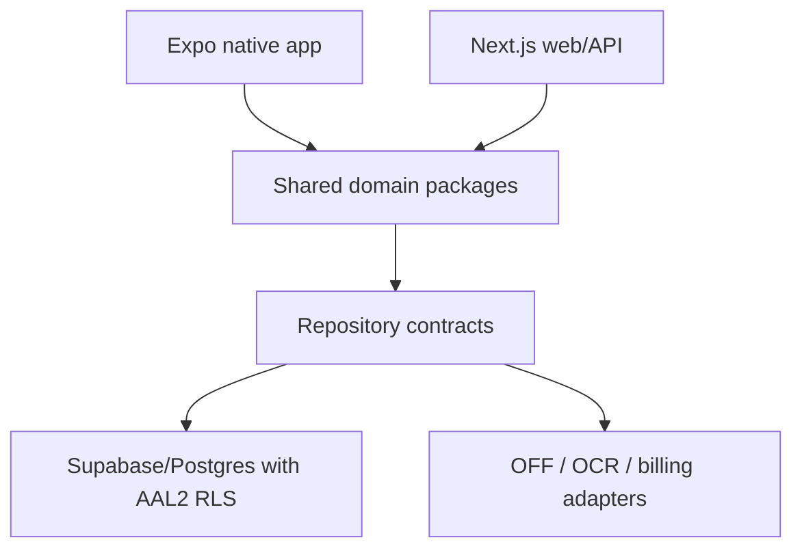

# FoodOS architecture plan

## Goal

Keep the mobile UI fast while ensuring nutrition, inventory, expiry, GS1, and ingredient
rules remain testable independently from React and Supabase. The architecture should be
clean through boundaries and names, not through unnecessary framework layers.

## Commercial target repository

The current Next.js application is evolved in place. Once native implementation begins,
move toward a workspace without breaking the verified web app:

| Target | Owns |
|---|---|
| `apps/web` | Next.js PWA, account/export/deletion/support, server routes, admin entry |
| `apps/mobile` | Expo/React Native UI, camera, secure session, offline queue, notifications, IAP |
| `apps/ops` | separately deployed CEO/Ops/finance console with AAL2 and role boundaries |
| `packages/domain` | pure inventory, GS1, MHD/use-by, recall match, nutrition, relevance, planning rules |
| `packages/contracts` | Zod/API schemas and versioned error/result types |
| `packages/sync` | local projection/outbox protocol, revisions, conflict policies and payload upgraders |
| `packages/risk-model` | privacy-safe metric/risk definitions only; no source credentials |
| `packages/design-tokens` | versioned primitive/semantic/component tokens and platform mappings; no business status rules |
| `packages/ui` | accessible shared recipes/primitives, deterministic state fixtures and visual-test harness |
| `supabase` | migrations, RLS, transactions, jobs and database tests |

No mobile screen loads the web product inside a general-purpose WebView. Sensitive
device data is sent only through versioned, validated API contracts.

## Target module responsibilities

| Area | Owns | Must not own |
|---|---|---|
| `src/app/` | routing, layouts, route handlers, server composition | reusable domain rules |
| `src/features/auth/` | auth/onboarding UI and orchestration | raw unrelated household queries |
| `src/features/scan/` | camera state, decode flow, review UI | OFF parsing internals |
| `src/features/inventory/` | inventory screens and use-case calls | inline nutrition math |
| `src/features/nutrition/` | log and target presentation | direct random table access |
| `src/features/ingredients/` | relevance UI and profile editing | ad-hoc medical scoring |
| `src/features/planning/` | week/meal/shopping UI | silent unit assumptions |
| `src/components/ui/` | accessible visual primitives | FoodOS business decisions |
| `src/domain/` | entities, value objects, use cases, pure rules | React, browser, Supabase SDK |
| `src/infrastructure/` | Supabase/OFF/OCR adapters and mapping | JSX and user-facing copy |
| `src/lib/` | narrow shared runtime helpers | dumping ground for feature code |

This is an incremental target. Move code when a feature is touched; do not perform a
large mechanical rewrite solely to match folder names.

## Server and client boundary

- secrets, OFF proxying, OCR provider calls, admin operations, and sensitive mutations
  remain server-side;
- camera, install prompts, online status, and immediate form interaction are client-side;
- prefer Server Components/semantic server-rendered initial data; add client code only
  for real browser/device interaction and lazy-load scanner/OCR/charts by route or intent;
- client mutations call typed server actions/route handlers or a narrow repository
  interface, not arbitrary table operations scattered across components;
- all external payloads enter as `unknown` and pass Zod validation before domain mapping.
- every household-data request requires an AAL2 session; AAL1 is limited to account,
  verification, MFA enrollment/challenge, recovery, and deletion initiation;
- native refresh/session credentials are stored with OS secure storage, never generic
  async/local storage.

## Transaction boundaries

| Operation | Atomic data |
|---|---|
| Create household | profile defaults, household, owner membership, risk profile |
| Add scanned batch | product upsert, source metadata, nutrition/ingredients, batch, event |
| Log consumption | food log, inventory event, batch balance |
| Dispose batch | batch status/quantity, inventory event |
| Generate shopping | generation revision, calculated items; preserve manual items |
| Apply recall notice | immutable source revision, affected match transitions, idempotent alerts |
| Accept offline operation | idempotency record, authorized mutation, canonical revision/change set |

Use database functions where they materially guarantee atomicity and RLS context. Each
mutation accepts an idempotency key when network retry could duplicate user intent.

## Data and trust model

Every externally sourced field should support:

- value and normalized value where relevant;
- source/provider and source record identifier;
- retrieved/updated timestamp;
- locale/language;
- confidence or verification state;
- user override without losing provenance.

Do not flatten „missing“, `0`, „provider said unknown“, and „user confirmed none“ into
the same state.

OFF-derived catalog/cache records remain identifiable and separable from proprietary
household, profile, rules, events, billing, and consent data. Join by normalized GTIN or
source reference; preserve license/provenance. Raw OCR images are processed on-device by
default or deleted from cloud processing within the documented retention window.

The shared public catalog is a third, separate boundary: its importer streams the
official JSONL export through a fixed allowlist into a service-role-only staging
generation. A service-only atomic activation selects exactly one generation for the
AAL2 read projections; direct client table access remains revoked. Household cache,
active shared generation, live provider and manual capture are distinct source states,
not interchangeable truths. Failed staging input leaves the prior active generation
unchanged. The current recovery path is a verified re-import, not an implemented
one-command generation rollback; see `docs/PUBLIC_CATALOG_OPERATIONS.md`.

Recall notices remain an immutable, source-versioned domain separated from household
matches. Exact/possible/text-candidate/unchecked state is calculated by deterministic
rules; a fuzzy name never writes an exact affected state.

Native clients use a versioned local projection plus durable outbox as specified in
`plans/OFFLINE_SYNC_AND_DATA_INTEGRITY.md`. The server remains authoritative. Consent,
membership, security, recall and financial states are never client-clock last-write-wins.

## Privacy and monetization boundaries

- Ad/analytics adapters accept a compile-time allowlisted event/context type that cannot
  contain product, GTIN, inventory, dates, nutrition, image, profile, or health fields.
- Ad SDKs are absent from sensitive routes and do not initialize before the applicable
  consent decision. Premium entitlements are server-verified and independent of ad
  consent.
- Consent, subscription entitlement, account data, and health-profile consent are
  separate domains with separate histories.
- Export/deletion are first-class asynchronous workflows with processor propagation,
  expiring export artifacts, backup tombstones, and auditable completion.

## Quality and release-proof boundary

The complete layers, thresholds and CI lanes are binding in
`plans/QUALITY_ENGINEERING_PLAN.md`; minimum requirements and C0 tests live in
`plans/TEST_TRACEABILITY_MATRIX.md`.

- pure domain packages stay framework-free so example, property and mutation tests are
  fast and deterministic;
- provider adapters expose contract-test fakes and validated fixture mappers;
- local Supabase is recreated from migrations/seeds and tested with pgTAP plus public
  client integration, never a production database copy;
- web E2E uses Playwright, native E2E uses Maestro plus targeted native tests;
- each release artifact carries a CI-generated evidence manifest bound to commit,
  dependencies, migrations, ruleset and binary/container digests;
- Ops Console treats missing, stale, skipped or flaky evidence as unproven, not green.
- recall adapters, sync state machines, model versions and OTA runtime/signature paths
  have contract/property/integration/mobile evidence.
- `plans/UI_UX_PERFORMANCE_PLAN.md` binds component/state, adaptive layout, WCAG/platform,
  bundle/Core Web Vitals and native startup/frame/memory evidence to the same release;
  representative usability evidence follows `plans/UX_RESEARCH_AND_USABILITY_TESTING.md`.

## UI and performance boundary

- domain state exposes semantic facts such as `recall_match=possible` or
  `sync_state=conflict`; UI maps them through named components and may not infer safety
  from a color/token;
- compact/medium/expanded layouts share route/task state and choose navigation/pane
  composition from the current window, safe area, font scale and input method;
- Apple/Android system material/navigation overrides live in the native UI layer while
  shared business copy, status and accessibility meaning remain platform-independent;
- images/fonts/assets have declared dimensions and optimized variants; product images
  retain source/license/provenance and never become telemetry identifiers;
- web vital/native vital collectors accept only route/flow template, release, metric,
  device/network class and coarse timing; identity, product, GTIN, date, food/health and
  household context is unrepresentable at the adapter boundary;
- scanner/OCR and long-list work are isolated from the initial shell and interaction
  frame; performance exceptions are versioned, owned and expiring rather than hidden in
  global averages.

## Observability and error boundary

The architecture in `plans/OBSERVABILITY_AND_ERROR_CONSOLE.md` is binding:

- typed domain/application/infrastructure errors cross one boundary per runtime;
- every critical flow propagates safe flow, trace/correlation and release identifiers;
- OpenTelemetry is the vendor-neutral contract and an internal Collector allowlists and
  redacts fields before export;
- no tokens, identity, product/GTIN, date/lot, food/health/profile, image/OCR, free text,
  request bodies or store receipts enter ordinary telemetry;
- the separately authorized Ops Console aggregates release proof, flow health, issues,
  providers/jobs, mobile vitals and incidents without arbitrary user/SQL access;
- observability outages are isolated and never roll back a successful user mutation.

## CEO, analytics and finance boundary

`plans/CEO_CONTROL_CENTER.md` defines the semantic and trust model.

- product analytics, observability, entitlements and finance are separate source domains;
- immutable external reports are hashed before validated staging and an exact
  double-entry finance ledger; dashboards consume a versioned metric layer;
- daily estimates never overwrite monthly final statements, and payouts reconcile to
  bank/accounting records before final status;
- money uses integer minor units or exact decimals with explicit currency/exponent,
  source FX and transaction/service/settlement/payout dates;
- product event payloads contain no product/food/health/profile data and never act as
  accounting evidence;
- `/ops` uses separate roles, mandatory AAL2, server-held connector secrets, audit and
  no arbitrary SQL/service-role/user impersonation;
- tax outputs stay estimates until entity-specific adviser approval and filing/payment
  evidence.
- C13/C14 consume versioned, source-backed risk/deadline facts from isolated connectors;
  the dashboard cannot execute forbidden legal/medical/safety actions or query private
  household data.

## AI, update and build boundary

`plans/SECURITY_AI_AND_UPDATE_GOVERNANCE.md` is binding:

- model/provider versions enter through a registry, evaluation, canary and kill switch;
- OCR returns proposed per-field candidates only; deterministic confirmation remains in
  the domain/application layer;
- OTA bundles are signed, runtime/fingerprint compatible and traceable to release
  evidence; production publishing is separated from consumer/admin runtime roles;
- build, store and signing secrets remain in protected CI/secret-manager scopes with
  least privilege and rotation; no runtime service can publish an app update.
