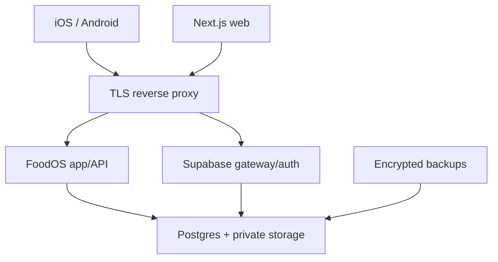

# FoodOS authentication and self-hosting plan

Status: **security architecture**. Production setup uses the official, pinned Supabase
self-hosting distribution or a managed EU Supabase project. A handcrafted partial auth
stack is not acceptable.

## Authentication contract

1. User creates an account with verified email and a strong password/passkey-capable
   first-factor roadmap.
2. Before any household data is accessible, the user enrolls a TOTP authenticator.
3. A successful TOTP challenge upgrades the session from AAL1 to AAL2.
4. RLS requires AAL2 for every household, product-personalization, inventory, nutrition,
   plan, shopping, and health-profile read/write.
5. Recovery, factor replacement, and suspicious-session actions require the reviewed
   recovery ceremony, revoke/reauthentication controls and a security notification. Email
   or support assertion alone never upgrades a session to AAL2.

The app never implements password hashing, token generation, TOTP verification, or
session rotation itself. These are delegated to Supabase Auth. Browser sessions use the
official SSR cookie pattern; mobile sessions use the official client with encrypted OS
credential storage. Tokens never enter analytics, URLs, crash breadcrumbs, or logs.

## Required account flows

| Flow | Required behavior |
|---|---|
| Sign-up | email verification, terms/privacy links, age confirmation, no bundled marketing consent |
| Sign-in | generic credentials error, rate limits, AAL check, no account enumeration |
| TOTP enroll | QR plus manual secret, challenge before activation, recovery explanation |
| TOTP challenge | code retry limits, clock guidance, cancel/sign-out path |
| Recovery | pre-enrolled one-time recovery material or delayed/risk-checked lost-factor ceremony; revoke/notify/audit; no helpdesk-only bypass |
| Factor change | AAL2/recent auth, security email, audit event |
| Export | AAL2/recent auth, asynchronous bundle, expiring link |
| Delete account | in-app and public web request path, consequence preview, recent auth, status receipt |

The mandatory 2FA policy is disclosed before account creation. App review receives a
dedicated, non-production review account or deterministic demo mode with synthetic data;
there is no production backdoor or shared bypass code.

One-time recovery material is displayed once after successful AAL2 enrollment, stored
server-side only in an appropriate hashed/encrypted form, rate-limited and rotated as a
set after use/reissue. The exact mechanism requires a threat review against the selected
Supabase/Auth capabilities. Ops/CEO break-glass is a separate identity and role path,
protected by a phishing-resistant factor where the chosen provider supports it, tested
quarterly and audited like an incident; it cannot read unrestricted user health data.

## Authorization model

- Household membership is the tenant boundary; role checks are enforced in Postgres.
- Supabase service-role credentials are server-only and used only by narrowly scoped
  jobs that require them.
- RLS is enabled and forced where practical. Automated tests use two unrelated users,
  two households, AAL1, AAL2, removed membership, and expired/replayed requests.
- Sensitive mutations are server-validated, transactional, and idempotent.
- Admin/support access is separate, least-privileged, audited, time-bound, and unable to
  reveal health/profile fields by default.

## Deployment topology

Only HTTPS ports 80/443 are public. Postgres, Supabase Studio, storage internals,
metrics, and admin endpoints stay on private networks or an authenticated VPN. TLS,
host firewall, automatic security updates, SMTP, DNS, monitoring, restore tests, and
secret rotation are part of the deployment, not optional server chores.

## Docker delivery contract

The deployment bundle must contain:

- a pinned FoodOS application image built from `Dockerfile`;
- the pinned official Supabase Docker Compose release and its required services;
- an environment template containing names/placeholders only;
- a one-shot migration command that fails safely;
- reverse-proxy/TLS instructions;
- backup, restore, update, rollback, and secret-rotation runbooks;
- health checks and production smoke commands.

Acceptance on a clean supported Linux VM:

1. Generate unique secrets and configure SMTP/domain without committing secrets.
2. Start the pinned stack using documented Compose commands.
3. Apply migrations exactly once and record the migration revision.
4. Create, verify, enroll TOTP, authenticate at AAL2, and persist a test batch.
5. Prove AAL1 and a second household cannot access the batch.
6. Back up, delete the disposable stack, restore, and verify the record.
7. Confirm no database/admin port is reachable from the public internet.

Self-hosting does not remove controller responsibilities under data-protection law. It
adds patching, availability, email deliverability, monitoring, incident response, and
backup obligations. For an early commercial launch, managed EU Supabase may carry less
operational risk; portable Docker remains a required exit strategy.

## Baseline operations

- EU hosting by default; document all subprocessors and remote support paths.
- Encryption in transit and at rest; application-level encryption or separated storage
  is required for health/profile fields when the threat model confirms the launch schema;
  key service, rotation, recovery and ciphertext versioning must be tested.
- Daily encrypted backups with tested restore; backup retention maximum 30 days unless
  a documented legal/operational need says otherwise.
- Security logs are pseudonymous, access-controlled, and normally retained 30 days.
- Dependency/container scanning, patch SLA, secret scanning, rate limits, WAF rules,
  SMTP abuse protection, and alerting are release gates.
- Auth mail uses an owned production domain with reviewed SPF, DKIM and DMARC, bounce/
  complaint/rate monitoring, registrar/DNS access recovery and an approved provider
  fallback. A green app uptime card cannot hide broken verification/recovery delivery.
- Incident runbook includes containment, evidence preservation, risk assessment,
  user/regulator communication, and the GDPR 72-hour notification decision process.

## Official implementation references

- Supabase self-hosting with Docker: <https://supabase.com/docs/guides/self-hosting/docker>
- Official Supabase Compose source: <https://github.com/supabase/supabase/tree/master/docker>
- Supabase TOTP MFA/AAL: <https://supabase.com/docs/guides/auth/auth-mfa/totp>
- Supabase SSR client pattern: <https://supabase.com/docs/guides/auth/server-side/creating-a-client>
- Supabase password auth: <https://supabase.com/docs/guides/auth/passwords>
- Supabase Auth rate limits: <https://supabase.com/docs/guides/auth/rate-limits>
