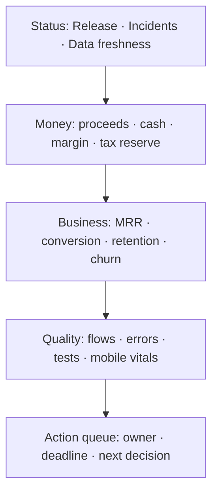
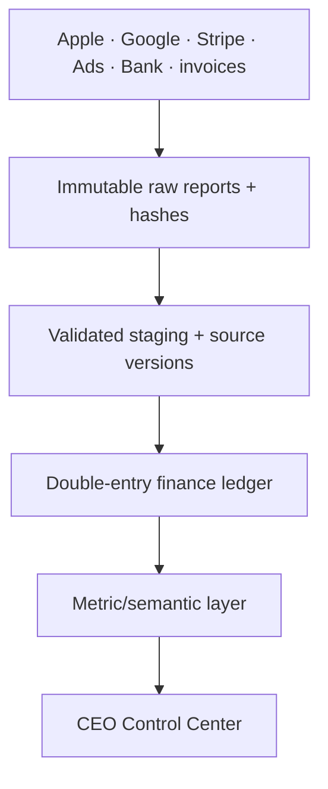

# FoodOS CEO Control Center

Status: **binding dashboard, finance-data and operating-review specification**. The
dashboard is designed for David as CEO and later for explicitly separated finance,
operations, privacy and support roles. It does not calculate or file legally binding tax
returns without reviewed accounting records and tax-adviser approval.

## CEO job to be done

Within 30 seconds, the default view must answer:

1. Is FoodOS and the current release healthy and proven?
2. How much did the business sell, earn, spend and receive?
3. Are subscriptions, advertising and user value improving or deteriorating?
4. What money is provisional, reconciled, payable, paid or still missing?
5. Which error, test, privacy, billing or support risk needs action today?
6. Which user-safety, liquidity, legal, platform or continuity risk could become
   irreversible next, and who owns the decision?

The dashboard has three operating modes:

| Mode | Decision window | Default comparison |
|---|---|---|
| CEO Today | incidents, release, sales estimate, cash and urgent deadlines | today vs comparable previous day/week |
| Weekly Business Review | funnel, retention, revenue, margin, reliability and experiments | complete week vs prior week/4-week average |
| Monthly Close | final store reports, payouts, fees, taxes, costs, reconciliation | fiscal/calendar month and year-to-date |

## Source hierarchy and truth labels

The same word “revenue” must never silently refer to three different sources.

| Domain | Authoritative source | Faster/provisional source | Required label |
|---|---|---|---|
| Apple final proceeds | App Store Connect financial report | Sales and Trends | `FINAL` or `ESTIMATE` |
| Google final earnings/payout | Play earnings/payout report | estimated sales/order/subscription APIs | `FINAL` or `ESTIMATE` |
| Store entitlement | signed Apple/Google server state plus internal entitlement ledger | client receipt/cache | `VERIFIED` or `PENDING` |
| Ad revenue | finalized AdMob/provider report | daily estimated API report | `FINAL` or `ESTIMATE` |
| Web payment | payment provider balance/transaction/report | webhook event | `RECONCILED` or `PENDING` |
| Cash | imported bank statement/accounting record | expected payout schedule | `BANKED` or `EXPECTED` |
| Costs | approved supplier invoice/accounting/bank | metered provider estimate | `BOOKED` or `FORECAST` |
| VAT/tax | tax-adviser/accounting/filing record | rule-engine estimate | `APPROVED`, `FILED`, `PAID` or `ESTIMATE` |
| Product usage | privacy-safe first-party event model | none | freshness/coverage shown |
| Tests/releases | signed CI evidence manifest | running CI status | `PROVEN`, `FAILED`, `BLOCKED`, `NOT PROVEN` |
| Errors/health | OpenTelemetry/Sentry/platform vitals | synthetic probes | source and freshness shown |

If the authoritative source is missing, the card stays visible with `NO SOURCE` or
`STALE`; it never substitutes a weaker number without changing the label.

## Information architecture

| ID | Area | Main decisions |
|---|---|---|
| C01 | CEO Today | continue, pause release, investigate or wait? |
| C02 | Revenue & subscriptions | which channel/plan/cohort drives proceeds, refunds and churn? |
| C03 | Usage & product value | are households activating, returning and completing core flows? |
| C04 | Costs & gross margin | which provider/operation consumes margin or exceeds budget? |
| C05 | Tax, payouts & accounting | what is estimated, reconciled, due, filed, paid or discrepant? |
| C06 | Quality & releases | does the exact artifact pass all tests and evidence gates? |
| C07 | Errors & operations | what failed, since which release, with what impact and owner? |
| C08 | Privacy, security & compliance | any forbidden data, DSR backlog, incident or country gate? |
| C09 | Growth & experiments | which acquisition/price/onboarding change improves value safely? |
| C10 | Support & customer voice | top issue, refund/ad report, rating and response backlog? |
| C11 | Forecast & runway | cash, committed cost, forecast, scenarios and decision points? |
| C12 | Sources & data quality | which connector/report is late, incomplete or unreconciled? |
| C13 | Risk & continuity | what must be contained, reduced, accepted temporarily, transferred or stopped? |
| C14 | Corporate & platform calendar | which legal, tax, store, domain, certificate, contract or policy action is due and proven? |

Ops screens O01–O10 from `plans/OBSERVABILITY_AND_ERROR_CONSOLE.md` power C06–C08.
CEO view summarizes impact and action; raw engineering detail remains role-restricted.
`plans/CEO_RISK_AUTOMATION.md` is binding for C13/C14, the three survival KPIs and A0–A3
automation authority.

## Default CEO Today layout

The page is summary-first and chart-led:

- top status bar: production health, release proof, P0/P1 incidents, last complete data;
- money strip: estimated/final proceeds, banked cash, gross margin, approved/estimated
  tax position — each as separate cards with source and period;
- 30/90-day charts: MRR/net proceeds, active households/retention, gross margin and
  critical error rate with release annotations;
- driver panels: conversion/churn/refunds by channel/plan, cost by provider, flow success;
- action queue: only decision-worthy items with severity, euro/user impact, owner, due
  date, runbook and primary action;
- survival strip: sourced 13-week cash trough, trusted core-loop guardrail and the
  highest-velocity residual risk; `NO SOURCE`/`STALE` is never reassuring;
- source footer: connector freshness, coverage and reconciliation difference.

Global filters are intentionally few: period, channel (`Apple`, `Google`, `Web`, `Ads`),
country/storefront, plan and release. Finance defaults to production only. Environment is
a separate quality/operations filter and cannot mix sandbox/TestFlight with real money.

## Metric dictionary

### Revenue and cash

| Metric | Exact definition | Primary source |
|---|---|---|
| Gross customer sales | consumer price before refunds; tax inclusion explicitly indicated | store/payment report |
| Refunds/chargebacks | reversed customer amounts in source period and currency | final store/payment reports |
| Net customer sales | gross sales minus refunds/chargebacks, before platform fees unless stated | normalized finance ledger |
| Store/platform fees | Apple/Google/payment/ad network fees as separate lines | final financial reports/invoices |
| Tax collected/withheld | tax amount reported by channel/jurisdiction/treatment | source report + reviewed tax mapping |
| Net proceeds | amount contractually owed after source-reported taxes/commission/adjustments | Apple/Google/payment final report |
| Cash received | payout matched to bank statement | bank/accounting reconciliation |
| Recognized revenue | amount recognized for the service period under approved accounting policy | accounting ledger |
| Deferred revenue | paid amount assigned to future service periods | accounting ledger |
| MRR | normalized recurring recognized subscription revenue for active paid entitlement | entitlement+accounting model |
| ARR | 12 × current MRR; shown as run-rate, not booked revenue | derived from MRR |
| ARPPU | recognized subscription revenue ÷ unique paying accounts in period | metric model |
| Refund rate | refunded transaction count/value ÷ eligible paid transactions/value | finance ledger |
| Payout variance | expected final proceeds minus banked payout after timing/FX mapping | reconciliation |

Never call gross sales, proceeds, payout or recognized revenue simply “Umsatz” without
the definition visible in the tooltip/metric catalogue.

### Subscriptions and monetization

- active, new, renewed, canceled, expired, grace/on-hold and refunded subscriptions;
- Free→trial→paid conversion with exact eligibility denominator;
- trial conversion, voluntary/involuntary churn and win-back;
- plan/monthly/yearly mix, country/channel mix and cohort retention;
- premium restore failures and entitlement mismatches;
- ad requests, impressions, match/fill, estimated/final revenue, eCPM and reports;
- ads per free active household and inappropriate-ad rate;
- no revenue metric may optimize health/profile targeting or increase ads in sensitive
  flows.

### Product usage and value

Use privacy-safe allowlisted first-party events only:

- new verified accounts and activated households;
- weekly/monthly active households, with bot/test/support accounts excluded;
- scan started→decoded→product found/manual→batch confirmed funnel;
- MHD/use-by capture coverage and reminder action completion as aggregates;
- inventory, consumption, plan and shopping weekly adoption;
- F00–F08 completion/error/abandonment rates;
- D1/D7/D30 household retention and paid/free cohorts;
- offline queue conflicts/recoveries and provider fallback rate;
- recall exact/possible/unchecked coverage, false match corrections and source freshness;
- export/deletion completion, support volume and rating trend.
- research cadence/coverage and unresolved critical usability findings by flow, without
  participant recordings, quotes or identifiable profiles in the CEO dashboard.

Do not collect raw barcodes, products, dates, calories, weight, allergies, images,
household names or free text for CEO analytics. Small cohorts are suppressed to reduce
re-identification risk.

### Cost and margin

Track actual invoice plus metered forecast separately:

- Apple/Google/payment commission;
- hosting, database, object storage, CDN and backups;
- OCR/API, email, push, observability/Sentry, analytics/CMP and advertising tech;
- EAS/CI/mobile builds, security scans, domains/certificates;
- legal, tax adviser, accounting, developer accounts, insurance and support;
- marketing acquisition spend and refunds/chargeback costs;
- payroll/contractors later, access-restricted.

`Gross margin = recognized revenue + recognized ad revenue – variable cost of service –
platform/payment fees`, using an approved chart-of-accounts mapping. Show contribution
margin separately when acquisition/support costs are included.

### Quality and operations

- exact release state and evidence freshness;
- PASS/FAIL/FLAKY/SKIP/BLOCKED/NOT_RUN counts by C0–C3 and test layer;
- coverage and mutation score for critical modules, never as sole quality KPI;
- F00–F08 success/latency/error budget, P0/P1 issues and mean time to detect/recover;
- crash-free iOS/Android sessions, hangs/ANRs, startup, memory/jank store vitals;
- web LCP/INP/CLS p50/p75/p95 by route/release/device class, bundle-budget status and
  native TTID/frame/frozen-frame/memory by release/device cohort;
- accessibility/assistive-technology and compact/medium/expanded release-evidence state;
- provider health, queue/dead-letter age, DB/connection/backup/restore state;
- privacy canary, unauthorized access, ledger mismatch and unsafe date suggestion counts
  have an exact-zero target.

## Finance ledger and data architecture

CEO totals never query a loose mix of product tables and analytics events.

### Canonical money record

- immutable `source_system`, source report/file ID/hash and source line ID;
- transaction/event/service-period/settlement/payout dates kept separately;
- channel, country/territory, SKU/plan, transaction/refund/fee/tax/adjustment type;
- original currency/amount and exponent using integer minor units or exact decimals;
- source FX rate and settlement currency; optional reporting conversion with rate source;
- debit/credit accounts, legal entity, tax treatment/version, confidence/status;
- ingestion/reconciliation batch, correction chain and audit timestamps.

Never use binary floating point for money. Never overwrite a financial line; append a
correction/reversal. Raw reports remain immutable, encrypted, access-controlled and
retained under the approved accounting/GoBD schedule.

### Reconciliation chain

1. Real-time store notification/order updates entitlement and creates a pending event.
2. Daily sales/estimated report updates provisional management metrics.
3. Monthly final financial report creates/reconciles accounting lines.
4. Store/payment payout matches a bank statement line.
5. Differences are classified as timing, FX, fee, tax, adjustment, refund/chargeback,
   missing source or parser error.
6. A close period becomes `RECONCILED`, then optionally `ADVISER APPROVED`, `FILED` and
   `PAID`; reopening requires reason, role and audit trail.

Dashboard cards display the unreconciled amount and last complete source period. A zero
variance produced by missing rows is a data-quality failure, not a successful close.

## Tax and accounting center

The center separates:

- German output VAT, deductible input VAT and reverse-charge mappings;
- store-reported/remitted indirect taxes by contract/territory;
- direct web-sale VAT and potential EU OSS amounts;
- withholding taxes and source documents;
- income/corporation tax and trade-tax estimates based on legal entity/profit;
- tax reserve/cash set aside, filing due, filed amount and payment;
- invoices/receipts, chart of accounts, booked costs and missing documents.

Tax treatment depends on FoodOS's legal entity, contracts, seller/merchant-of-record
position, customer country, storefront and transaction date. It is versioned and approved
by the tax adviser. The system does not assume Apple/Google handle every tax everywhere.

### Trust states

| State | Meaning |
|---|---|
| `ESTIMATE` | rule-engine or metered value; useful for planning only |
| `SOURCE FINAL` | final provider/report amount ingested and validated |
| `RECONCILED` | report, ledger and payout/bank differences resolved |
| `ADVISER APPROVED` | reviewed accounting/tax treatment and period |
| `FILED` | return/report submitted with reference and immutable artifact |
| `PAID` | bank transaction reconciled to filing/liability |

No CEO button sends a tax return at launch. The first production version exports a
validated DATEV booking batch plus evidence pack for adviser review. ELSTER/OSS filing
automation is a later, separately authorized and legally tested workflow.

### Tax calendar

Deadlines are configured per entity, registration and adviser-confirmed filing cadence;
they are not hardcoded from generic web advice. Alerts show owner, preparer cutoff,
official due date, estimated/approved amount, missing source reports, filed/payment proof.

## Forecasts and decision support

- actual, estimate, budget, target and forecast are distinct series and colors;
- base/upside/downside scenarios expose price, conversion, churn, ad yield, active
  households, variable cost and hiring/marketing assumptions;
- cash forecast uses expected payout calendars and booked commitments, not ARR;
- runway is available only after opening cash and recurring/committed costs are sourced;
- anomalies flag sudden revenue/refund/churn/cost/error changes but never claim causality;
- release/experiment annotations help a human test hypotheses against quality/usage data.

## Data quality gates

Every connector/metric reports:

- owner and authoritative source;
- grain, dimensions, timezone/currency and definition version;
- latest source period, ingestion time, expected cadence and staleness threshold;
- row/file count, duplicate/missing/invalid count and parser version;
- reconciliation total/difference and known source caveats;
- access/retention classification and test/sandbox exclusion rule.

Core finance data fails closed on duplicate source IDs, broken balance, unknown currency,
unsupported transaction type, unexpected sign or unreconciled period. Unknown lines enter
a review queue; they never disappear into “other”.

## Alerts and CEO action queue

Examples:

- current production release `FAILED`/`NOT PROVEN`, or new P0/P1 issue;
- cross-tenant/privacy/ledger/use-by zero-tolerance signal;
- recalled-batch suggestion, recall-source stale/schema drift, sync data loss/tombstone
  resurrection or OCR false-high-confidence guardrail;
- payout report or bank match overdue; reconciliation variance over approved threshold;
- abnormal refund/chargeback/churn, entitlement mismatch or revenue drop;
- provider/hosting/CI/observability spend exceeds budget or forecast;
- 13-week cash trough, overdue liability or entity/platform deadline crosses its reviewed
  threshold; store/ad account warning, certificate/signing-key or contract expiry;
- MRR/gross margin/activation/retention misses an approved decision threshold;
- tax source missing, adviser close overdue, filing/payment deadline approaching;
- App Store/Play crash/ANR thresholds or rating/support backlog deteriorating.
- Core Web Vitals, route bundle, native startup/frame/memory or accessibility evidence
  crosses its release threshold; a critical usability finding passes its due date.

Each alert shows why it fired, source freshness, financial/user impact, confidence,
owner, deadline, runbook and one primary action. Correlation is shown as correlation, not
causation.

## Access, privacy and audit

- separate `/ops` application/domain, not a hidden consumer route;
- mandatory AAL2, short sessions, IP/device/risk controls as approved;
- roles: CEO, finance, engineering responder, release manager, privacy/security,
  support; each sees only required aggregates/drill-downs;
- store/API/bank/accounting credentials stay in a server-side secret manager;
- raw finance documents, source maps and incident evidence have separate permissions;
- no direct production SQL, service-role browser key or user impersonation;
- every export, close/reopen, mapping, flag, incident and role action is audited;
- no personal food/health data in metrics and no employee/support performance ranking
  from incomplete operational signals.
- high-risk automation is limited to the A0–A3 matrix; forbidden legal/medical/safety
  actions do not exist as executable dashboard commands.

## Test requirements for the CEO Center

### Metric and finance correctness

- unit tests for every metric definition, sign, period, denominator and status;
- property tests for money/FX/rounding and double-entry balance invariants;
- contract fixtures for every Apple/Google/Stripe/AdMob/bank/invoice report version;
- duplicate, late, corrected, reversed, partial and unknown transaction tests;
- daily estimate→monthly final→payout→bank reconciliation integration tests;
- subscription event ledger versus final financial report and entitlement reconciliation;
- tax treatment version, DATEV export format and period close/reopen tests;
- no sandbox/TestFlight/internal-test transaction can enter production totals.

### Dashboard and access

- source freshness/staleness and missing-source states;
- all cards/charts/tables reconcile to one semantic definition;
- filters update compatible metrics and never mix currency/period/grain incorrectly;
- CEO/finance/ops/privacy/support role matrix and AAL2 E2E;
- responsive desktop/tablet, keyboard, focus, screenreader, contrast and print/export;
- performance cards use percentiles, sample/route/device coverage and release/source
  freshness; no green average hides a failed route or device cohort;
- research status distinguishes planned/running/observed/retested and never turns a
  synthetic session, internal opinion or missing recording into user evidence;
- deep link from CEO issue/test/release card to the authorized Ops evidence;
- injected stale/failed/flaky/missing evidence must never render green;
- forbidden food/health/identity canaries cannot enter analytics/finance/telemetry;
- Playwright E2E covers Today→Revenue→Tax→Release→Issue→action queue and export.

### Data-pipeline reliability

- ingestion idempotency, checkpoint/resume, backfill and rate-limit behavior;
- source credential revoked, report delayed/schema changed, corrupted file and outage;
- immutable raw hash verification and parser-version reproducibility;
- ledger rebuild from raw source yields the same close before approved corrections;
- backup/restore preserves source files, audit and close status without duplicating lines;
- alert fires when freshness/reconciliation quality fails.
- risk threshold/hysteresis/deduplication/escalation, owner/deputy and acceptance-expiry;
- cash/platform/legal source staleness cannot produce green; A2 containment is scoped,
  audited and reversible; forbidden automation cannot be invoked by API or UI.

## Delivery stages

### CEO 0 – Release and error cockpit

Use signed CI evidence plus Ops Console to show release status, tests, flows, errors,
providers, incidents and action queue. No invented finance data.

### CEO 1 – Provisional business health

Connect privacy-safe usage, Apple Sales and Trends, Google estimated sales/subscription
state and AdMob estimates. Label all money provisional; add source freshness.

### CEO 2 – Finance-grade monthly close

Ingest immutable Apple/Google financial reports, costs/invoices and bank statements;
implement exact ledger, reconciliation, final proceeds/margin and close workflow.

### CEO 3 – Tax-adviser workflow

Configure entity/chart/tax treatments, tax calendar, DATEV export, document evidence,
adviser approval/filed/paid states. Do not auto-file until separately approved.

### CEO 4 – Forecast, budgets and experiments

Add sourced cash/runway, scenarios, acquisition costs, experiment ledger, anomaly
detection and decision journal after historical data quality is proven.

### CEO 5 – Risk and continuity automation

Add sourced 13-week cash, C13/C14, official policy/deadline evidence, provider/channel
concentration, access/key/restore/OTA state, A0–A3 automation and quarterly game days.
This remains `NO SOURCE` until live bank/accounting/store/security/legal-calendar inputs
are connected and validated.

## Release gate

The CEO Center is trustworthy only when:

- every hero metric has a visible definition/source/status/period/freshness;
- final values reconcile to final reports and bank/accounting records;
- estimates cannot be mistaken for booked/filed/paid values;
- test and release status is signed and artifact-matched;
- permission, privacy, redaction and audit tests pass;
- no unexplained finance variance, stale critical connector or unknown transaction line;
- a tax adviser approves entity-specific mappings and export before operational use.

## Primary source references

- Apple Sales/Trends and financial reporting: <https://developer.apple.com/help/app-store-connect/measure-app-performance/overview-of-reporting-tools/>
- Apple final proceeds: <https://developer.apple.com/help/app-store-connect/getting-paid/view-payments-and-proceeds/>
- Apple App Store Server API: <https://developer.apple.com/documentation/appstoreserverapi>
- Google Play earnings/payout reports: <https://support.google.com/googleplay/android-developer/answer/6135870?hl=en>
- Google Play subscription state: <https://developers.google.com/android-publisher/api-ref/rest/v3/purchases.subscriptionsv2>
- AdMob reporting API: <https://developers.google.com/admob/api>
- BZSt EU One-Stop-Shop: <https://www.bzst.de/DE/Unternehmen/Umsatzsteuer/One-Stop-Shop_EU/one_stop_shop_eu_node.html>
- BMF GoBD: <https://ao.bundesfinanzministerium.de/ao/2025/Anhaenge/BMF-Schreiben-und-gleichlautende-Laendererlasse/Anhang-33/inhalt.html>
- DATEV booking-batch format: <https://developer.datev.de/de/file-format/details/datev-format/format-description/booking-batch>
- ELSTER business filings: <https://www.elster.de/elsterweb/infoseite/unternehmer>
- German crisis monitoring, §1 StaRUG: <https://www.gesetze-im-internet.de/starug/__1.html>
- German insolvency filing duty, §15a InsO: <https://www.gesetze-im-internet.de/inso/__15a.html>
- Google Play enforcement process: <https://support.google.com/googleplay/android-developer/answer/9899234?hl=en>
- Google AdMob invalid traffic: <https://support.google.com/admob/answer/3342054?hl=en>
