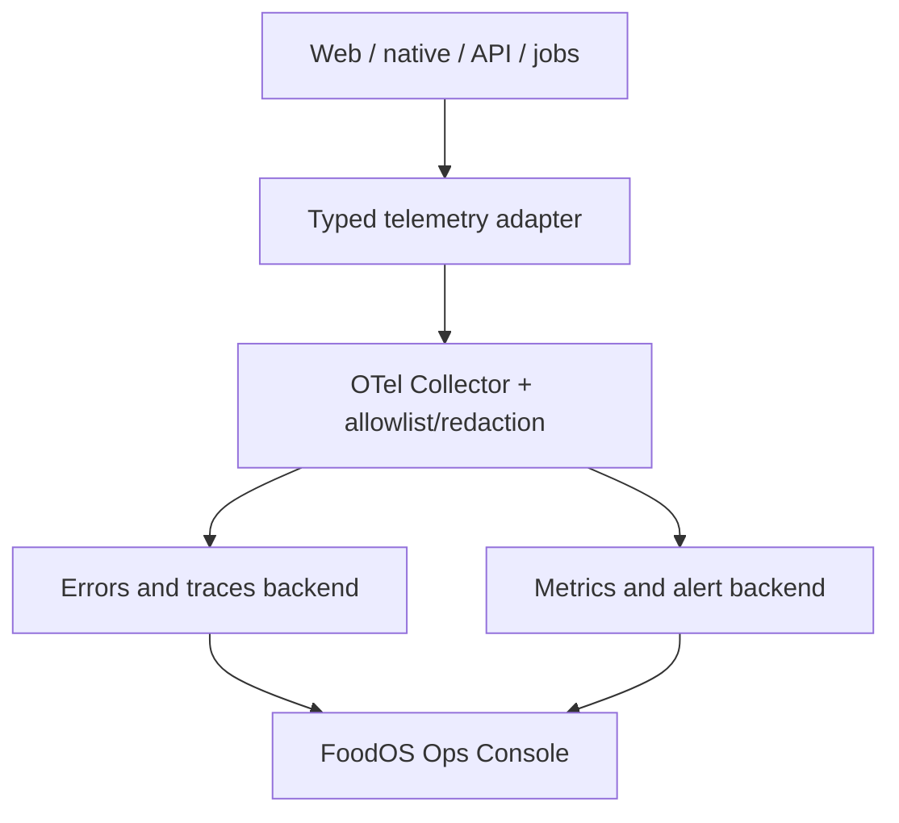

# FoodOS observability, error console and incident plan

Status: **target operations architecture**. The “FehlerConsole” is an internal,
separately authorized operations product. It must answer: what failed, for which flow,
since which release, in which component, how often, what is the user impact, and what is
the safe next action — without exposing a user's food or health data.

## Outcome

Every request, background job and critical client flow receives:

- stable `flow_id` and `operation`;
- random `trace_id`/`correlation_id` propagated across allowed boundaries;
- typed public-safe `error_code` and internal error class;
- release/build/migration/ruleset identifiers;
- environment, service and provider status;
- timing, outcome and retry/idempotency state;
- redaction-policy version.

The user sees a short German recovery message and, when support can act on it, a safe
reference such as `FOS-SCAN-7H4K2`. They never see a stack trace, SQL/provider payload,
secret or internal authorization detail.

## Architecture



Recommended boundary:

- OpenTelemetry is the vendor-neutral instrumentation and transport contract;
- the Collector applies an allowlist, redaction, sampling, batching and export rules
  before data reaches any backend;
- Sentry is the initial candidate for exception grouping, releases, source maps,
  regressions and performance issues; use an EU-hosted agreement or the official
  self-hosted distribution after an operational/privacy review;
- platform truth from Apple MetricKit/App Store Connect and Android vitals/Play Console
  is ingested as summarized release/device metrics;
- FoodOS Ops Console aggregates status/evidence and deep-links to restricted raw tools;
  it does not duplicate raw stack/event storage in the main product database.

No observability component is allowed to block a successful inventory transaction. It
uses bounded queues, timeouts, sampling and failure isolation.

## Typed error taxonomy

| Class | Example | User behavior | Operator behavior |
|---|---|---|---|
| `VALIDATION` | invalid date/unit/barcode | highlight field and preserve input | aggregate only unless spike |
| `AUTHENTICATION` | expired session/TOTP | reauthenticate without account leak | monitor rate/attack indicators |
| `AUTHORIZATION` | wrong household/AAL | generic denial | P0 on unexpected regression |
| `CONFLICT` | concurrent batch edit | show both states/resolution | track sync/conflict rate |
| `NOT_FOUND` | OFF/product/batch missing | manual/recovery path | provider/product trend |
| `RATE_LIMITED` | provider/auth limit | wait/retry guidance | capacity/abuse alert |
| `DEPENDENCY` | OFF/OCR/SMTP/store down | graceful fallback | provider status/circuit breaker |
| `INTEGRITY` | ledger mismatch/impossible state | stop unsafe mutation | P0 incident and reconcile |
| `PRIVACY` | forbidden telemetry/vendor call | block emission/SDK | P0 incident investigation |
| `BILLING` | receipt/webhook mismatch | no destructive entitlement guess | P0/P1 by charge/access impact |
| `RECALL` | exact/possible/stale source state | official action or honest unchecked path | P0 if affected item suggested/false clear |
| `MODEL` | OCR evaluation/canary regression | manual capture remains usable | pause model cohort/rollback version |
| `UPDATE` | OTA signature/runtime/crash guardrail | use embedded/known-good build | reject/pause/rollback and preserve evidence |
| `CONTINUITY` | cash/deadline/access source stale | show no-source and owner | CEO escalation; never automated legal filing |
| `INTERNAL` | unexpected exception | safe reference and retry | issue grouping/stack/release |

Domain code returns typed results. Unknown exceptions are caught once at a trust
boundary, assigned a reference, reported through the adapter and rethrown/translated
according to the contract. Do not scatter `console.error` with raw objects throughout
components.

## Canonical telemetry envelope

Allowed baseline fields:

```text
timestamp, environment, service, platform, app_version, build_id, commit_sha,
migration_version, ruleset_version, flow_id, operation, outcome, error_code,
error_class, severity, retryable, attempt, duration_bucket, http_status_class,
provider, trace_id, span_id, correlation_id, issue_fingerprint, redaction_version
```

Forbidden fields include access/refresh tokens, passwords/TOTP secrets/codes, email,
name, full/raw IP, household or user ID, product/brand/ingredient text, GTIN/barcode,
MHD/use-by/lot, inventory/consumption/nutrition/calorie/weight/allergy/profile data,
images/OCR text, free text, notification text, URLs/query strings carrying identifiers,
request/response bodies, store receipts and full database statements.

Use coarse irreversible operational buckets where possible. Even hashed small-space IDs
may be re-identifiable; hashes do not automatically make data anonymous.

## Redaction defence in depth

1. Compile-time allowlisted event types expose no arbitrary context map.
2. SDK `beforeSend`/equivalent rejects unknown keys and sensitive routes.
3. Logger formatter serializes only named primitives and message templates.
4. OpenTelemetry Collector redaction processor drops every non-allowlisted attribute and
   blocks secret/PII patterns.
5. Backend data-scrubbing rules provide a final safety layer.
6. Automated tests inject canary secrets, fake emails, GTINs, allergens and dates and
   prove none arrive in the backend/artifact.
7. Quarterly sampling audit and every-SDK-update network audit validate actual behavior.

Session replay is off at launch. Breadcrumbs are event names only, with no input value,
DOM text from sensitive screens, body, URL parameter, image or clipboard content.

## Ops Console information architecture

| ID | Screen | Answers | Primary action |
|---|---|---|---|
| O01 | Release proof | Did this exact build pass every required gate? | inspect missing/failed evidence |
| O02 | Live health | Are web, API, DB, jobs, providers and stores healthy now? | open incident/owner |
| O03 | Issues | What errors are new, regressed or increasing? | assign, acknowledge, resolve |
| O04 | Flow health | Where does F00–F08 fail and at which boundary? | compare release/segment |
| O05 | Trace detail | Which service/provider span caused this safe issue? | open source/trace/runbook |
| O06 | Jobs/providers | Queue lag, dead letters, OFF/recall/OCR/SMTP/push/billing/model state? | retry safe item/disable provider |
| O07 | Privacy/security | Forbidden-event count, consent/SDK/network gate, auth anomalies? | trigger P0 procedure |
| O08 | Mobile quality | crashes, hangs/ANRs, startup, jank, memory by release/device | halt/stage rollout |
| O09 | Incidents | current impact, timeline, decisions, communication, recovery? | execute runbook/update status |
| O10 | Audit/admin | who viewed/changed alerts, flags, issues or incidents? | review/export audit |
| O11 | Experience quality | LCP/INP/CLS, bundle, accessibility evidence and critical usability debt by route/release/cohort? | inspect regression/pause rollout |

### Release proof screen

The top card has exactly one status:

- `PROVEN`: all required evidence passes and artifact hashes match;
- `BLOCKED`: a required external environment could not run;
- `FAILED`: at least one required gate failed;
- `NOT PROVEN`: missing, stale, hand-authored or mismatched evidence.

It shows commit, container digest, web build, iOS/Android fingerprints, migration/ruleset,
country pack, test counts by true state, coverage/mutation, security/privacy/load results,
signatures and deployment history. It must never infer green from an old report or a CI
job name.

### Issue detail

- issue title is a normalized message template, not raw user content;
- first/last seen, count/rate, environments, release regression and affected flow;
- safe stack with uploaded private source maps and suspect commit range;
- representative trace waterfall and provider timing without bodies/identifiers;
- reproduction/test link, owner, severity, status, SLA and runbook;
- deploy/feature-flag correlation and “fixed in” release;
- actions: assign, acknowledge, create GitHub issue, link incident, mark resolved;
- muting requires reason, owner and expiry; C0 issues cannot be muted.

No arbitrary production SQL, user lookup, raw household browsing, impersonation or
service-role console exists inside Ops Console.

## Service health and SLOs

Track outcomes users care about, not just CPU:

| SLI | Target/alert concept |
|---|---|
| Authenticated app availability | 99.9% monthly target after launch baseline |
| Core mutation correctness | ≥99.5% successful, excluding validated user rejection |
| AAL2/RLS unauthorized success | exactly zero; immediate P0 |
| Ledger reconciliation mismatch | exactly zero; immediate P0 |
| Post-use-by unsafe suggestion | exactly zero; immediate P0 |
| Applicable recall suggested/false-clear outage | exactly zero; immediate P0 |
| Confirmed offline intent lost/duplicated | exactly zero; immediate P0 |
| Unsigned/wrong-runtime production OTA accepted | exactly zero; immediate P0 |
| Forbidden telemetry/ad field/vendor | exactly zero; immediate P0 |
| Product lookup success/fallback | success plus manual path, provider-specific |
| Queue/job freshness | warning/error thresholds per job criticality |
| Export/deletion completion | within published internal SLA; no silent stall |
| Premium entitlement mismatch | exactly zero wrongful charge/access; P0/P1 |
| Crash-free native sessions | ≥99.8% launch target |
| Web Core Vitals | LCP ≤2.5 s, INP ≤200 ms, CLS ≤0.1 at p75, split by route family, release and mobile/desktop |
| Native startup/frame/memory | targets from UI/UX plan by release and pinned device cohort; zero frozen critical-flow frames |
| Accessibility/usability evidence | exact release/flow status; unresolved critical finding or missing required AT evidence blocks release |
| API latency | thresholds from Quality Plan, segmented by release |

Use burn-rate alerts for availability/latency SLOs and immediate alerts for zero-tolerance
invariants. Alerts need owner, severity, runbook, deduplication, cooldown and test button.
An alert that nobody will act on is a dashboard metric, not a page.

## Severity and response

| Severity | Example | First response target | Release action |
|---|---|---:|---|
| P0 | data exposure, cross-tenant access, wrong charge, ledger corruption, unsafe use-by/recall recommendation, confirmed-intent loss, malicious update | 15 min during supported production coverage | stop rollout/kill switch/contain; executive+legal/privacy path |
| P1 | login/core scan/inventory widely unavailable, deletion/export stalled | 30 min | pause rollout; mitigate/rollback |
| P2 | degraded provider, localized flow/accessibility/performance failure | business-day ownership | fix in bounded release |
| P3 | cosmetic/low impact | backlog with trend | normal prioritization |

Targets become formal support commitments only after staffing/on-call capacity exists.
Before that, the product cannot claim 24/7 response.

## Incident lifecycle

1. Detect and deduplicate issue/alert.
2. Assign incident commander and severity; start immutable timeline.
3. Contain using rollout pause, provider/ad/OCR flag, credential/session revocation or
   read-only mode. Never disable RLS, 2FA, use-by warnings, export or deletion to recover.
4. Identify affected releases, services, countries and data categories from safe
   aggregates; preserve evidence with access audit.
5. Correct/rollback and run targeted plus full required regression tests.
6. Verify production synthetics, reconciliation and privacy/security state.
7. Communicate accurately; execute GDPR/store/vendor notifications when required.
8. Publish internal postmortem: impact, detection gap, root/system causes, actions,
   owners/dates and added tests/alerts/runbooks.

## Feature flags and kill switches

Server-controlled, audited flags exist for OCR/model/cloud upload, OFF/recall refresh,
advertising, analytics, push delivery, meal suggestions and new billing offers. Flags have owner,
scope, default, expiry and tests for both states. Security controls, RLS, TOTP requirement,
MHD/use-by distinction, existing official recall warnings, export and deletion are not
feature-flagged off. Disabling recall refresh must produce a prominent stale/unchecked
state, never hide prior alerts.

## Access and retention

- separate operations identity, mandatory AAL2, least privilege and short sessions;
- roles: viewer, responder, release manager, privacy/security; no shared accounts;
- source maps private and accessible only to responders;
- every issue/incident/flag/alert/admin action audited;
- raw error/trace/log retention proposed at 30 days, aggregated SLI at 13 months, incident
  evidence per counsel/security schedule; final values go into the data register;
- production access reviews quarterly and immediately on role departure/change;
- support sees a user-provided safe reference, never searches by private food/health data.

## Failure injection and console acceptance

Before release, deliberately cause:

- browser render error, native crash and handled domain error;
- API 500, validation 400, AAL1 403 and dependency timeout;
- DB constraint/RLS denial and deadlock/retry;
- OFF/recall/OCR/SMTP/push/billing outage and malformed response;
- recall correction/retraction and stale feed, OCR false-high-confidence regression;
- offline kill/reorder/duplicate, stale-member replay and tombstone restoration;
- unsigned/wrong-runtime/crashing OTA plus rollback and signing-role abuse attempt;
- stale/missing cash/legal/platform source and forbidden CEO automation attempt;
- queue dead letter, failed export/deletion job and ledger mismatch canary;
- telemetry backend and Collector outage/full queue;
- forbidden fake PII/health/GTIN fields at every telemetry layer.

Acceptance: the product recovers safely, the expected issue/metric/alert appears once,
release and flow correlation are correct, forbidden content does not appear, the runbook
works, and resolution/regression state is visible after the fixed release.

## Primary technical references

- OpenTelemetry signals and Collector: <https://opentelemetry.io/docs/>
- OpenTelemetry sensitive-data handling: <https://opentelemetry.io/docs/security/handling-sensitive-data/>
- Next.js instrumentation: <https://nextjs.org/docs/app/api-reference/file-conventions/instrumentation>
- Sentry releases/issues: <https://docs.sentry.io/concepts/key-terms/key-terms/>
- Sentry self-hosting: <https://develop.sentry.dev/self-hosted/>
- Apple MetricKit: <https://developer.apple.com/documentation/metrickit>
- Android vitals: <https://developer.android.com/topic/performance/vitals>
- Core Web Vitals: <https://web.dev/articles/vitals>
- WCAG 2.2: <https://www.w3.org/TR/WCAG22/>
