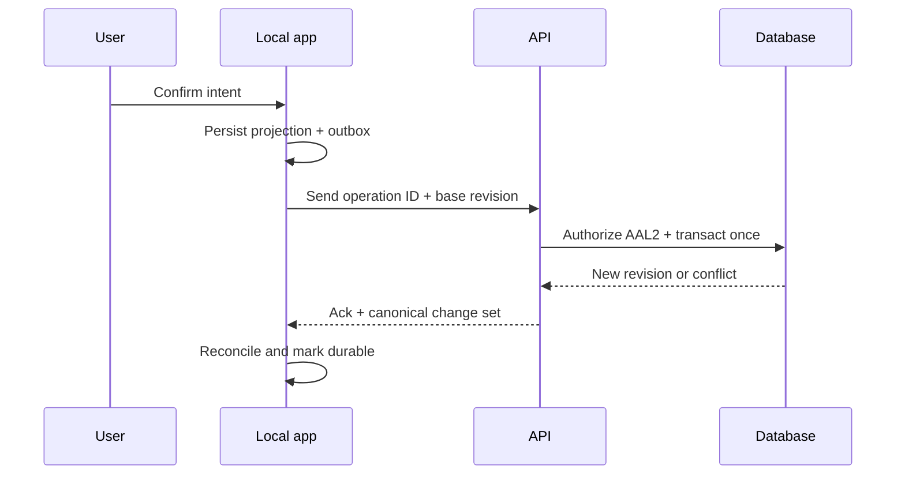

# FoodOS offline synchronization and data-integrity plan

Status: **C0 distributed-data contract**. “Works offline” means that the app explains
what is cached, queues supported intent safely and reconciles deterministically. It does
not mean every server function is available or that the newest household state is known.

## Non-negotiable invariants

- An accepted user intent has one effect, even after retry, app restart or reconnect.
- Inventory never becomes negative silently and consumption is not duplicated.
- A stale or removed household member cannot replay queued writes.
- Deletion/logout revokes sessions and purges or cryptographically makes inaccessible
  local private data according to the approved lifecycle.
- Conflicts are visible; a last-write-wins timestamp never decides safety, quantity,
  consent, membership, finance or recall state.
- The server is authoritative for shared state; the local database is an explicit
  versioned projection plus outbox, not an independent truth.

## Local data model

Each supported offline operation stores:

- random operation/idempotency ID, operation kind and schema version;
- household, actor, device-installation and target entity IDs;
- base server revision/ETag and normalized intent payload/hash;
- local created order plus last attempt; server time is assigned on acceptance;
- state `LOCAL`, `QUEUED`, `SENDING`, `ACKED`, `CONFLICT`, `REJECTED` or `BLOCKED`;
- retry count, typed safe error and dependency on earlier local operations.

Tokens remain in OS secure credential storage. The device threat model chooses OS file
protection plus application/field encryption or an audited encrypted database for local
private projections; ordinary unencrypted async storage is not acceptable. Logs and OS
backups must not copy secrets or unrestricted health/profile data.

## Synchronization sequence

The API keeps an idempotency record long enough to cover supported offline/retry windows.
Payload mismatch with a reused key is a security/integrity error, not a second request.
Retries use bounded exponential backoff with jitter and respect server rate limits.

## Entity-specific conflict rules

| Entity/action | Resolution |
|---|---|
| consume/dispose quantity | server transaction validates current balance; insufficient stock returns current state and explicit correction/untracked option |
| add physical batch | unique operation creates one batch; an intentional second package needs a new operation ID |
| edit date/lot/location | field-level base revision; show local and server values, source/confidence and author for explicit merge |
| shopping check/uncheck | versioned item event; preserve manual item identity and report concurrent delete/edit |
| plan regeneration | new calculation revision; never overwrites manual items or a newer user edit |
| delete | server tombstone wins over stale edits; queued writes become blocked and cannot resurrect data |
| membership/consent/security | online-only or server-confirmed; never resolved from client clock or last write |
| recall/entitlement | server/provider authority; cached state is labeled with last verification and may fail closed |

## User-visible states

- `Offline · Stand von 14:32`: cached read, freshness visible.
- `Auf diesem Gerät gespeichert`: durable locally but not yet shared.
- `Wird synchronisiert`: one operation currently in flight.
- `3 Änderungen warten`: queue summary with safe detail.
- `Konflikt – Entscheidung nötig`: both meaningful values and consequence.
- `Abgelehnt`: membership/session/validation changed; no automatic retry loop.
- `Aktuell`: server acknowledgement for the displayed revision, not a general uptime claim.

Closing or killing the app cannot lose confirmed local intent. Destructive reset/uninstall
explains unsynced consequences; the app does not claim recovery for data never accepted by
the server.

## Session, household and deletion boundaries

- Every reconnect revalidates session AAL, membership and supported client version before
  flushing private writes.
- Sign-out stops sync and removes tokens; user chooses to discard or first sync queued
  non-sensitive work only while still authorized.
- Removed members receive a generic rejection, local household projections are purged and
  queued operations are quarantined/deleted without revealing new server state.
- Account deletion creates server tombstones before processor propagation. A restored
  backup replays tombstones before accepting old-device operations.
- Device loss/session revoke invalidates refresh credentials; device-installation state is
  visible in account security without collecting invasive fingerprints.

## Version and OTA compatibility

- API contracts are versioned and advertise minimum/current supported client versions.
- Database changes use expand→backfill→dual-read/write where needed→contract only after
  old-client telemetry/expiry gates.
- Each outbox payload has a deterministic upgrader or is blocked with a user-recoverable
  export; never reinterpret unknown fields silently.
- An OTA update cannot change local schema/native assumptions without a compatible runtime
  version and migration tests.
- Rollback must read any data written by the staged update or deliberately stop before
  mutating incompatible local state.

## Capacity and privacy

- Cap queue size, image payload and retry work; warn before device storage pressure.
- Large OCR images are not kept in the general outbox. Upload is separate, explicit,
  resumable and deleted under its short retention rule.
- Background work respects OS limits, battery/network policy and metered-data choice.
- Sync telemetry contains operation kind, duration, state and safe error only — no payload,
  product, GTIN, date, lot, quantity, health field or household identity.

## Required tests

- kill/relaunch after local confirmation, during request and after server commit before ack;
- same idempotency key with same and different payload;
- 2–5 devices editing/consuming the same batch with reordered, duplicated and delayed packets;
- client clock days wrong, timezone/DST change and leap day;
- membership removal, AAL downgrade, password reset and session revoke with queued writes;
- tombstone/backup restore versus a months-stale device;
- local schema upgrade, OTA rollback and minimum-client rejection;
- low disk, database corruption, OS background suspension and network flapping;
- queue cap/rate limit/provider outage without battery or request storm;
- invariant/property tests and model-based state-machine tests for every operation kind;
- telemetry canaries proving private payload fields never leave the sync boundary.

## Release gate

Native launch is blocked until every critical mutation declares its offline policy,
idempotency retention, conflict rule, schema upgrader and user recovery. The supported
offline window and cache freshness are documented. Any unexplained duplicate, lost
confirmed intent, stale-member write or tombstone resurrection is C0.
