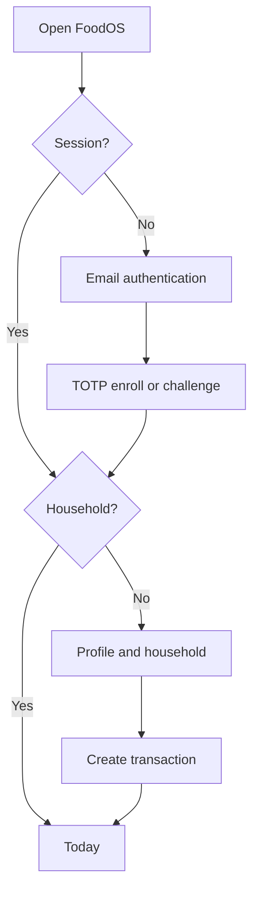
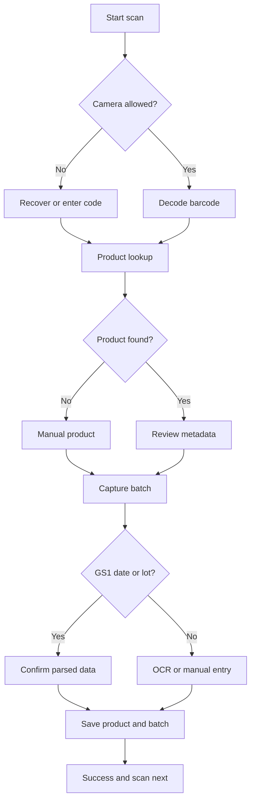
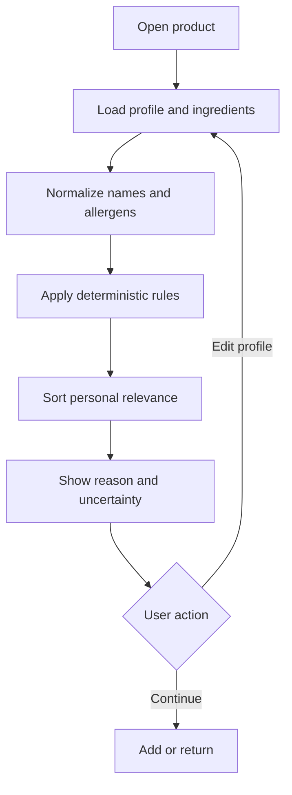
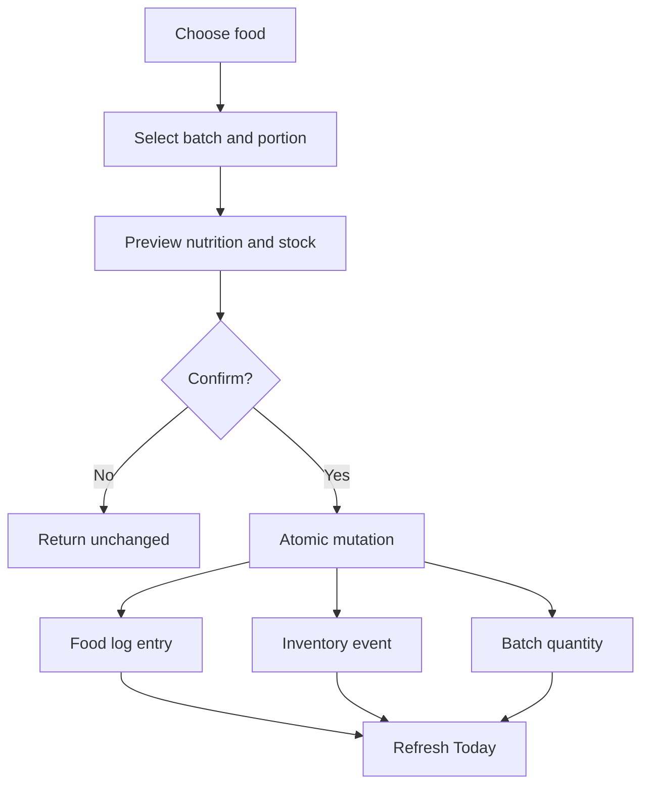
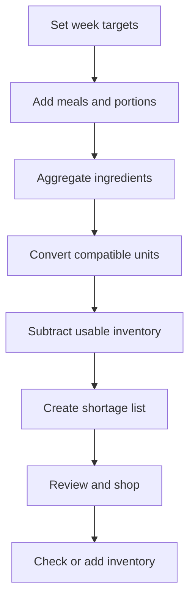

# FoodOS canonical user flows

Status: **binding MVP behavior** · IDs are stable references for code, tests, and PRs.

## F00 – Eligibility and privacy choices

Rules:

- Germany-first launch states 16+ before account creation;
- terms/privacy acknowledgement, optional sensitive-profile consent, advertising/CMP,
  analytics, marketing, image-cloud processing, and OFF contribution are separate;
- refusal of nonessential processing keeps the core app usable;
- privacy choices remain reachable and withdrawal is as easy as acceptance;
- no ad/analytics SDK initializes before its applicable legal/consent decision.

Acceptance path: select “only necessary” → create and use an account → see no
nonessential SDK traffic → reopen privacy choices → make or withdraw an optional choice.

## F01 – First session, 2FA, and household

Rules:

- authentication success without a household resumes onboarding;
- email/password gives AAL1; all private household access requires successful TOTP and
  AAL2, including after a session is downgraded;
- household, owner membership, profile defaults, and food-risk profile are created as
  one recoverable operation;
- returning users never see onboarding flash while session state is loading;
- failure preserves entered non-secret fields and offers a retry;
- lost-factor recovery uses pre-enrolled recovery material or the reviewed delayed/risk-
  checked ceremony; support alone can never grant AAL2.

Acceptance path: sign in → enroll/verify TOTP → create household → refresh browser →
land on Today with the same household. AAL1 and a second household cannot read it.

## F02 – Scan product and add a physical batch

Required states:

| Boundary | Behavior |
|---|---|
| Local product exists | show immediately and refresh stale metadata in background |
| OFF succeeds | validate, normalize, store provenance and retrieval time |
| OFF times out/not found | manual creation remains possible; no dead end |
| GS1 `15` | label as minimum durability date and request confirmation |
| GS1 `17` | label distinctly as use-by/expiry date |
| OCR low confidence | highlight individual date/lot fields; never auto-save |
| Duplicate request | no duplicate product; intentional additional batch allowed |
| Save fails | no half-created batch; retain confirmed form data for retry |

Acceptance path: scan or manually enter `3017624010701` → review source-backed product →
enter/confirm MHD and quantity → add batch → see it in inventory after reload.

After a confirmed use-by date, FoodOS must not recommend consumption. MHD remains a
quality date with inspect guidance and no safety guarantee.

## F03 – Review ingredients by personal relevance

Sorting is stable: personal avoid → exposure watch → information → no conflict found →
unknown. Unknown data cannot become green. Each item records rule/evidence version,
source, confidence, reason, and last update. The UI never converts an E-number alone into
a harm claim.

Acceptance path: add a personal exclusion → reopen a matching product → see it first in
red with a personal explanation → remove exclusion → result recalculates deterministically.

## F04 – Consume food and update inventory

Rules:

- default batch follows FEFO where safe: earliest relevant date first;
- portion conversion uses explicit units and never assumes grams from pieces without a
  conversion;
- log, inventory event, and batch balance commit atomically;
- an idempotency key prevents double booking on retry;
- insufficient stock offers correction or untracked consumption, never negative stock
  silently.

Acceptance path: log 100 g from a 500 g batch → batch becomes 400 g → nutrition appears
once on Today → retrying the same request does not subtract again.

## F05 – Plan week and derive shopping shortages

Rules:

- planned nutrition updates immediately when portions change;
- only compatible units are combined; uncertain conversion stays separate;
- expired/use-by-invalid inventory is excluded; MHD inventory may require confirmation;
- list items retain source: plan, manual, or suggested refill;
- manual items survive regeneration and checked state persists;
- costs are labeled estimates and shown only for source-backed prices.

Acceptance path: plan a recipe requiring 1 kg rice with 300 g usable inventory → shopping
shows 700 g shortage → modify plan to 500 g → shortage becomes 200 g without deleting a
manual shopping item.

## Shared flow state contract

Every async flow exposes a typed state equivalent to:

| State | UI responsibility |
|---|---|
| `idle` | explain next action |
| `loading` | retain stable known content and show local progress |
| `success` | confirm persisted result and next action |
| `empty` | explain why empty and offer creation path |
| `error` | human message, retry, and preserved input where safe |
| `offline` | distinguish cached visibility from unavailable mutation |
| `permission_denied` | exact recovery plus non-permission fallback |
| `conflict` | show competing values and require explicit resolution |

Critical tests reference flow IDs, for example `F02-off-lookup-timeout` or
`F04-idempotent-consumption`.

## F06 – Subscription, privacy, export, and deletion

- Free core behavior stays usable after ad/analytics refusal; Premium removes ads and
  unlocks convenience/ongoing-value features, never safety/security/rights.
- Native purchases use StoreKit/Play Billing and support restore, expiry, refund, and
  revocation without losing user-owned data.
- Export requires recent AAL2 and returns a short-lived JSON/CSV bundle.
- Account deletion is available in app and through a public web request path, requires
  re-verification, revokes sessions, propagates to processors, and tracks backup expiry.
- No advertisement appears anywhere in this flow.

Acceptance path: buy Premium in sandbox → restore after reinstall → export → request
deletion → reauthenticate → receive status → verify sessions and active data are removed.

## F07 – Recall check and affected batch

Rules:

- every confirmed batch is evaluated against currently available approved official
  sources using deterministic, versioned match rules;
- exact GTIN+lot is distinct from possible GTIN-only and text-only candidate matches;
- an applicable recall overrides MHD and removes the batch from consume/plan suggestions;
- stale/unavailable source is `UNCHECKED`, never a green “not recalled” result;
- the UI presents source, affected identifiers, publication/update time and the official
  consumer action without promising safety;
- alert acknowledgement records action but never changes official applicability;
- no ad or private product detail appears in a lock-screen notification.

Acceptance path: ingest a synthetic official recall → match one household's GTIN+lot →
show the official action and exclude the in-date batch → correct/retract the notice →
re-evaluate without deleting history. An unrelated household receives no detail.

## F08 – Offline intent, synchronization and recovery

Rules:

- confirmation persists the supported operation locally before network send;
- each operation has one idempotency ID, base server revision and visible queue state;
- reconnect revalidates AAL2, membership and client compatibility;
- inventory/consent/membership/recall conflicts are never resolved by device clock or
  silent last-write-wins;
- kill/relaunch, response loss and duplicate delivery preserve exactly-one server effect;
- deletion tombstones beat stale-device writes and a removed member cannot flush a queue;
- the user sees cached freshness, pending, conflict, rejected and current states.

Acceptance path: consume a batch offline → kill/relaunch → reconnect after another device
changed the same batch → receive canonical acknowledgement or explicit conflict → never
lose the confirmed intent, duplicate consumption or create negative stock.
